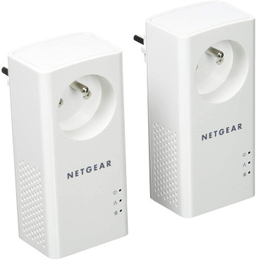
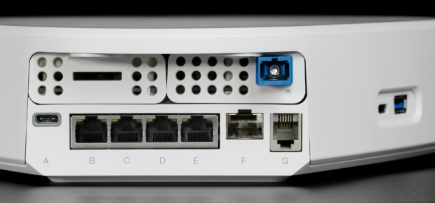
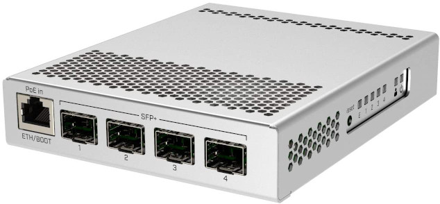
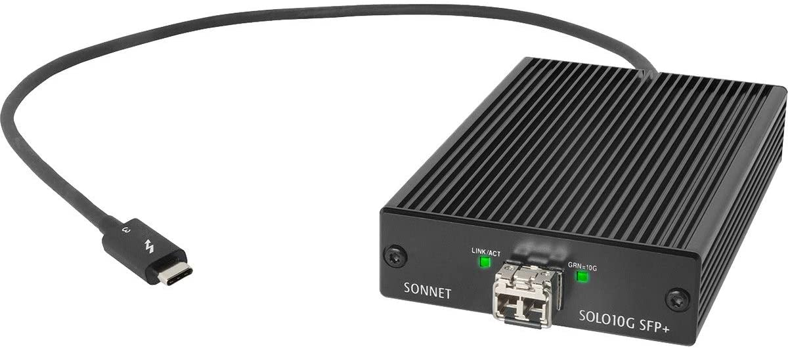
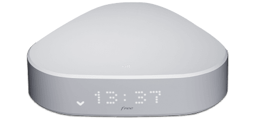
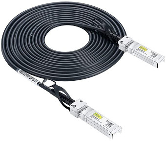
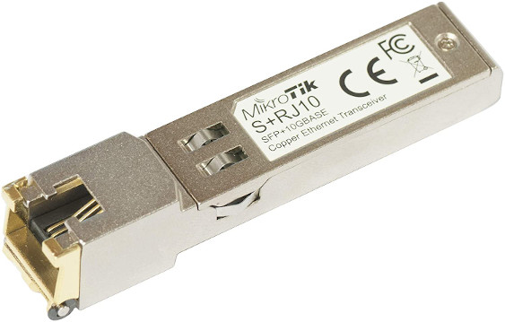

<!-- PROJECT SHIELDS -->
[![Contributors][contributors-shield]][contributors-url]
[![Forks][forks-shield]][forks-url]
[![Stargazers][stars-shield]][stars-url]
[![Issues][issues-shield]][issues-url]
[![GNU License][license-shield]][license-url]

<!-- PROJECT LOGO -->
<br />
<p align="center">
  <a href="https://github.com/AntoineMeheut/OptimNetwork">
    
  </a>

  <h3 align="center">Optimize the use of your private network and your fiber optic subscription</h3>

  <p align="center">
    Sharing of experience on optimizing the use of an internet box and fiber bandwidth in the context of family confinement.
    <br />
    <br />
    <a href="https://github.com/AntoineMeheut/Rock-Mk3/issues">Report Bug</a>
    ·
    <a href="https://github.com/AntoineMeheut/Rock-Mk3/issues">Request Feature</a>
  </p>
</p>

<!-- ABOUT THE PROJECT -->
## About The Project
Like many of us, we all found ourselves at home all day, overnight, whereas before we only met at the end of the day and on weekends. Parents to work, children to school and the whole family to access activities or information on the internet. The solution imposed on all of us was to massively use the internet access from the house to do all these activities.

As we had not really experienced this kind of situation before, the use we made of our network was really not optimized.

The first fault we had was that most of the equipment that accesses the internet was connected to the box by wifi. This is the easy way we all use and the result has sometimes been that we have saturated the bandwidth. The other striking fact that I discovered by looking closely at this internet box and that we were not using all of its possibilities.


### My goals

* Adapt the channels of access to the internet box according to the uses,
* Free up wifi bandwidth as much as possible,
* Try to make the most of the capacities offered by our fiber optic access.

### <span style='color:red'>Warning</span>

<span style='color:red'>I have an internet box from the Free company, it's a Delta S model and I also have 10Gb fiber optic access. If you don't have the fiber some of the advice shared here is not suitable for you and if you are using another type of internet box, your choices of material may need to be adapted to your box.</span>

## Use cases and use of available solutions
### How to adapt the access channels to the internet box according to the uses
With the internet boxe in the living room, it had been a while since the children, without being network experts, realized that WiFi was really not the best technical solution to the growing need for bandwidth on their video games console. When we found ourselves confined to the house, the parents realized that the children were right. Especially on Wednesday afternoons, when your conference call becomes impossible because a game of Fortnite is starting.

The first point I wanted to resolve was the overuse of wifi bandwidth. My first targets were therefore computers and the video game console.

The place where we live is not equipped within the walls of a dedicated network, which is more and more the case in recent constructions, which are wired. On the other hand, it has an electrical network which, thanks to power line technology, can be used by all equipment which has an RJ45 type socket.



I therefore equipped the living room and the bedroom with a couple of CPL terminals and RJ45 cables, being careful to take RJ45 category 7 cables which are well protected against electromagnetic disturbances.


The final result gives a theoretical signal up to 1 Gb, the measurement I made gave me 406 Mb, but in the opinion of the children it changed their life and ours too because the wifi signal is protected from fortnite.

### Try to make the most of the capacities offered by our fiber optic access.
The second point that I dealt with is a question that has been trotting in my head for a little while. On the CPL and the Wifi I measure approximately 500 Mb of signal. And I pay for a 10Gb tehoric fiber line. How do I get out of Mb and feel like I'm paying for something I'm using?



The RJ45 sockets of the Delta-S box (B, C, D and E on the photo) have a maximum theoretical speed of 1Gb, that's good, but we are still far from the 10Gb promised. This is where you have to focus on the F socket, it is an SFP+ type socket that allows a theoretical throughput of up to 10Gb, so it is this socket that must be used to get closer to 10Gb.



As there is only one socket, I advise you to use a network switch to multiply the possible uses. This switch allows me to supply the rooms with powerline and to directly connect a laptop computer thanks to a Sonnet 10Gb box.



I arrived at a measured flow of 5gb (by choosing well the internet target for the measurement) and the transfer of large files between the computer to other equipments is very fast. The real speed seen on the internet really depends on the sites you are going to surf, but I have seen the speed of the solution, for example to download Centos ISO images from university sharing sites that allow 10Gb connection.

## Hardware
### Shopping list
Here is the shopping list, with links (not affiliated) to references that I have used.
I let you search for other equipment and especially how to buy this equipment according to your favorite stores and your type of internet boxe.



#### List of equipment to be connected to and next to the internet box

| Number | Use | Lien |
| ------ | --- | ---- |
| 1 | Cable from Delta-S to SFP+ switch| [10Gtek® Câble SFP+ 10G 0,5m](https://www.amazon.fr/gp/product/B01MRPJ60I/ref=as_li_qf_asin_il_tl?ie=UTF8&tag=6660fa-21&creative=6746&linkCode=as2&creativeASIN=B07LBKFNJ3&linkId=e520a31776b92bec7d3af24c860504eb&th=1) |
| 1 | SFP+ Switch | [Switch SFP+ 4 Ports](https://www.amazon.fr/gp/product/B07LFKGP1L/ref=as_li_qf_asin_il_tl?ie=UTF8&tag=6660fa-21&creative=6746&linkCode=as2&creativeASIN=B07LFKGP1L&linkId=1b0221cddddeb9d171036808a66c712c) |
| 1 | SFP+ to RJ45 adapter | [SFP+ to RJ45](https://www.amazon.fr/gp/product/B078SLL1G3/ref=as_li_qf_asin_il_tl?ie=UTF8&tag=6660fa-21&creative=6746&linkCode=as2&creativeASIN=B078SLL1G3&linkId=81e9809afb54ac2d7969fa169cbc69e2) |
| 1 | RJ45 Cat 7 cable 1m | [RJ45 Cat 7 cable 1m](https://www.amazon.fr/gp/product/B018KELJIE/ref=as_li_qf_asin_il_tl?ie=UTF8&tag=6660fa-21&creative=6746&linkCode=as2&creativeASIN=B018KELJIE&linkId=db8b89e9eccbefca1f914f9e72b52241) |
| 1 | Powerline box | [Powerline box](https://www.amazon.fr/PLP1000-100FRS-1000Mbps-filtr%C3%A9e-Compatible-Internet/dp/B01M1H8TIP/ref=sr_1_4?__mk_fr_FR=%C3%85M%C3%85%C5%BD%C3%95%C3%91&dchild=1&keywords=boitier+CPL&qid=1617457067&s=computers&sr=1-4) |

#### List of equipment for connecting a room via the CPL
| Number | Use | Lien |
| ------ | --- | ---- |
| 1 | Powerline box | [Powerline box](https://www.amazon.fr/PLP1000-100FRS-1000Mbps-filtr%C3%A9e-Compatible-Internet/dp/B01M1H8TIP/ref=sr_1_4?__mk_fr_FR=%C3%85M%C3%85%C5%BD%C3%95%C3%91&dchild=1&keywords=boitier+CPL&qid=1617457067&s=computers&sr=1-4) |
| 1 | RJ45 Cat 7 cable 2m | [RJ45 Cat 7 cable 1m](https://www.amazon.fr/gp/product/B018KELJIE/ref=as_li_qf_asin_il_tl?ie=UTF8&tag=6660fa-21&creative=6746&linkCode=as2&creativeASIN=B018KELJIE&linkId=db8b89e9eccbefca1f914f9e72b52241) |

#### List of equipment to connect with max speed a computer
| Number | Use | Lien |
| ------ | --- | ---- |
| 1 | SFP+ 10G cable 3m | [SFP+ 10G cable 3m](https://www.amazon.fr/gp/product/B01DCZCP1G/ref=as_li_qf_asin_il_tl?ie=UTF8&tag=6660fa-21&creative=6746&linkCode=as2&creativeASIN=B01DCZCP1G&linkId=97b71e46ba8203595cb0bccdc45acc13) |
| 1 | Sonnet 10Gb SFP+ | [Sonnet 10Gb SFP+](https://www.amazon.fr/gp/product/B07N327RJ2/ref=as_li_qf_asin_il_tl?ie=UTF8&tag=6660fa-21&creative=6746&linkCode=as2&creativeASIN=B07N327RJ2&linkId=192551454167cd37f15d974f3c975dd3) |

## Description of equipment
### SFP+ Switch


This equipment is very easy to connect to the electrical network and to the internet box. You plug in and it works. It just has a small flaw, if you want to access the switch configuration interface, it is its default IP address, which is 192.168.88.1

It is the xx.xx.88.xx that kills, because I am not on this network with my equipment. So at the first use I had to switch from DHCP to manual on my computer and change the network address of my computer, to access the interface and modify this default address.

### Cable from Delta-S to SFP+ switch


I placed my switch in a cabinet next to the internet box, so I opted for 50cm of cable, it is sufficient. It plugs very easily and you have to gently pull on the black loop to disconnect it, because as soon as you handle the optical fiber, you must always remember to perform the operations gently and especially without bending the cables too much, because be careful, the fiber breaks, unlike copper wire.

### SFP+ to RJ45 adapter


This adapter is really great, it's the little trick to get the maximum throughput in RJ45. I did some tests using the RJ45 output of the internet box and this adapter plugged into the SFP+ switch and I got better measured speeds.

### Sonnet 10Gb SFP+


This equipment is really not cheap, you have to have the use of it to invest and this is also what makes people say: "I really use the fiber package that I pay". There are cards for fixed boxes which are much more affordable. You will easily find.

## Clone this repo
If you haven't already done so, you can clone this repository to copy / paste the command lines.

```sh
git clone https://github.com/AntoineMeheut/OptimNetwork.git OptimNetwork
cd OptimNetwork
```

<!-- CONTRIBUTING -->
## Contributing

Contributions are what make the open source community such an amazing place to be learn, inspire, and create.
Any contributions you make are **greatly appreciated**.

1. Fork the Project
2. Create your Feature Branch (`git checkout -b feature/AmazingFeature`)
3. Commit your Changes (`git commit -m 'Add some AmazingFeature'`)
4. Push to the Branch (`git push origin feature/AmazingFeature`)
5. Open a Pull Request

<!-- LICENSE -->
## License

Distributed under the MIT License. See `LICENSE` for more information.

<!-- CONTACT -->
## Contact

If you want to contact me [just clic](mailto:github.contacts@protonmail.com)

Project Link: [https://github.com/AntoineMeheut/OptimNetwork](https://github.com/AntoineMeheut/OptimNetwork)

<!-- MARKDOWN LINKS & IMAGES -->
<!-- https://www.markdownguide.org/basic-syntax/#reference-style-links -->
[contributors-shield]: https://img.shields.io/github/contributors/AntoineMeheut/OptimNetwork?color=green
[contributors-url]: https://github.com/AntoineMeheut/OptimNetwork/graphs/contributors
[forks-shield]: https://img.shields.io/github/forks/AntoineMeheut/OptimNetwork
[forks-url]: https://github.com/AntoineMeheut/OptimNetwork/network/members
[stars-shield]: https://img.shields.io/github/stars/AntoineMeheut/OptimNetwork
[stars-url]: https://github.com/AntoineMeheut/OptimNetwork/stargazers
[issues-shield]: https://img.shields.io/github/issues/AntoineMeheut/OptimNetwork
[issues-url]: https://github.com/AntoineMeheut/OptimNetwork/issues
[license-shield]: https://img.shields.io/github/license/AntoineMeheut/kafka_producer
[license-url]: https://github.com/AntoineMeheut/kafka_producer/blob/master/LICENSE
